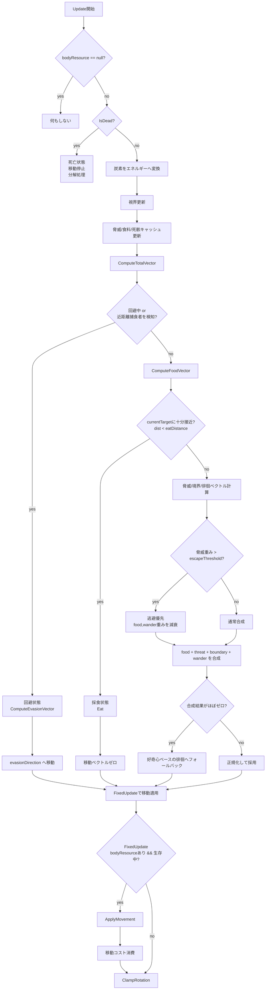
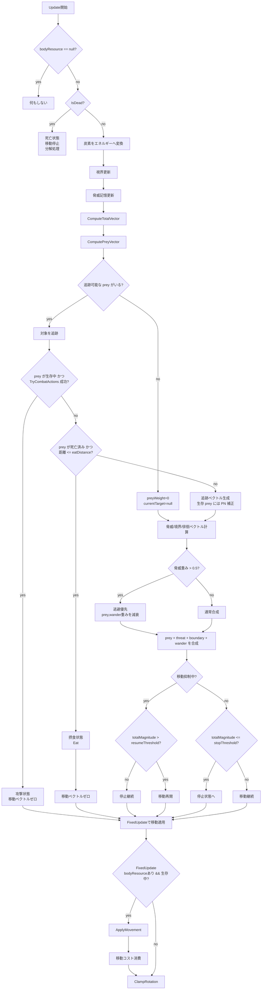
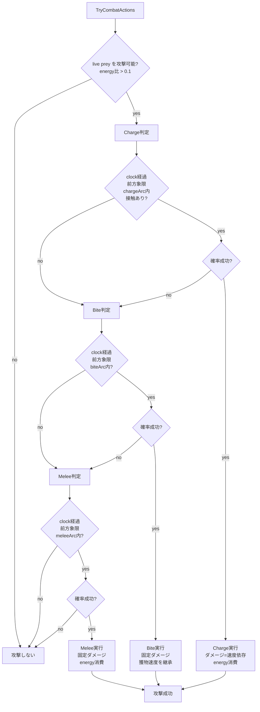
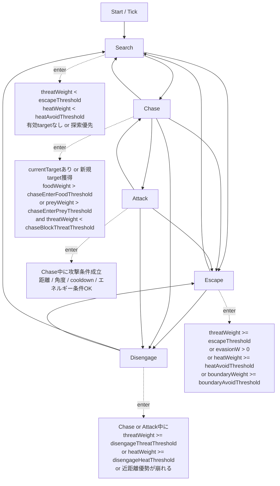
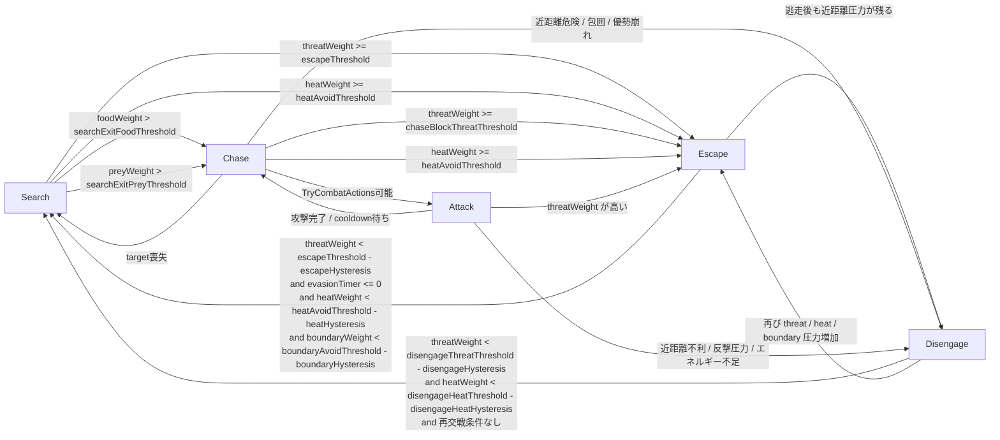
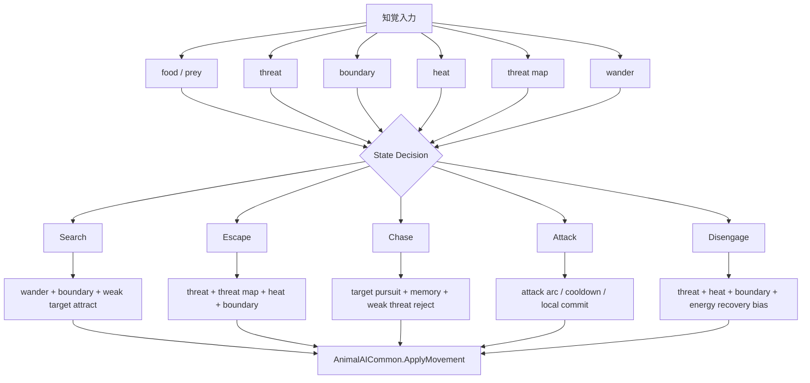

# 動物AI 状態機械フローチャート

`Mermaid Live Editor` / `Mermaid Live Editor (Fork)` にそのまま貼れるように、コード実装ベースで整理したフローチャートです。

参照元:

- `Assets/script/Ingame/behaviour/herbivore/herbivoreBehaviour.cs`
- `Assets/script/Ingame/behaviour/predator/predatorBehaviour.cs`
- `Assets/script/Ingame/AI/PredatorCombatLibrary.cs`

## 草食動物AI

### 草食動物AIの見方

- 実装上は明示的な `enum State` ではなく、`ComputeTotalVector()` の優先分岐が状態機械になっています。
- 優先度は `回避 > 採食(接触中) > 重み付き移動合成` です。
- `回避状態` は `isEvading`, `evasionTimer`, `evasionCooldownTimer` で継続管理されています。
- `逃避優先` に入っても完全停止ではなく、境界回避と徘徊を弱めつつ合成移動します。

## 肉食動物AI

### 肉食動物AIの見方

- メイン状態は `追跡 / 攻撃 / 死体摂食 / 逃避 / 徘徊 / 停止` の混成です。
- こちらも明示的な状態 enum ではなく、`ComputePreyVector()` と `ComputeTotalVector()` の条件分岐で構成されています。
- `停止状態` は `isMovementSuppressed` で管理され、`stopMoveThreshold` / `resumeMoveThreshold` にヒステリシスがあります。

## 肉食動物の攻撃サブフロー

## 実装メモ

- 草食の回避開始条件は `evasionDistance` 以内に捕食者が入ったときです。
- 草食の採食完了判定は `eatDistance` 未満です。
- 肉食は最寄りの記憶済み prey を選びますが、`disengageDistance` を超える対象は追跡しません。
- 肉食の生存 prey 追跡では `ComputeProportionalNavigationVector()` による迎撃補正を使います。
- 肉食の攻撃優先順は `Charge -> Bite -> Melee` です。

## 予定状態機械（仕様メモベース）

以下は [1.行動意思決定仕様の明文化.txt](C:/魔法環境シミュ/memo/タスク一覧/1.生態系コア強化/1.行動意思決定仕様の明文化.txt) と [設定：状態機械まとめ（IFF前段階）.txt](C:/魔法環境シミュ/memo/設定/設定：状態機械まとめ（IFF前段階）.txt) から拾った、実装予定の状態機械です。

現状実装よりも明示的な `enum` 状態を前提にしていて、主状態は次の 5 つです。

- `Search`
- `Escape`
- `Chase`
- `Attack`
- `Disengage`

### 予定図 全体フロー

### 予定図 遷移条件詳細

### 予定図 ベクトル統合との関係

### 仕様メモから読める意図

- 現状の「重み付き合成で擬似的に状態を作る」方式から、予定では `Search / Escape / Chase / Attack / Disengage` を明示状態として持つ方向です。
- `Escape`, `Disengage` にはヒステリシス付きの exit 条件があり、状態のバタつきを抑える想定です。
- `threat map` は主に `Escape` と `Disengage` の補助入力、`heat field` は将来的に `Escape` 側へ強く効かせる想定に見えます。
- `IFF` 導入後は `food/prey/threat` の解釈が所属関係で切り替わる前提です。
